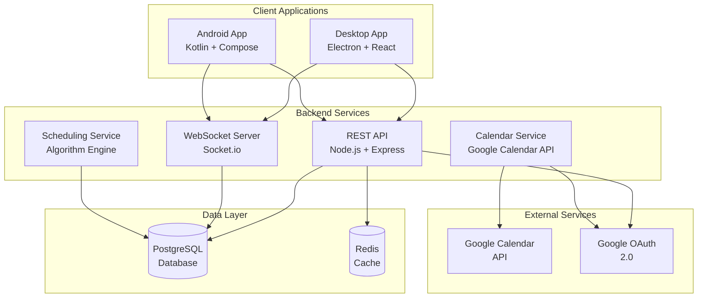
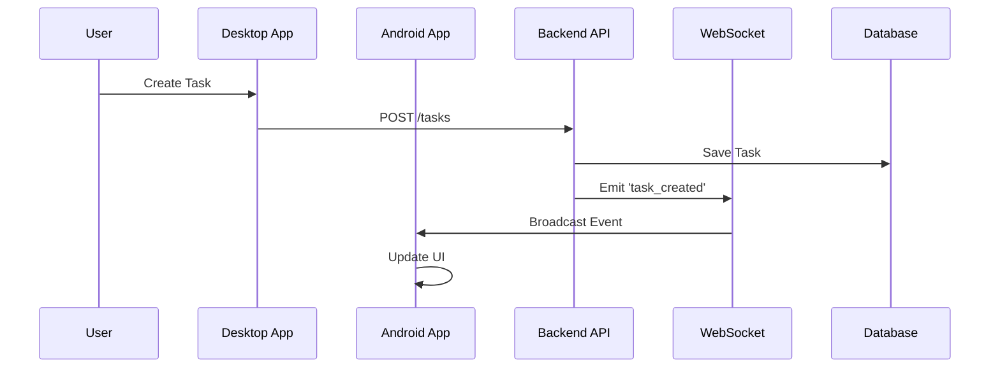
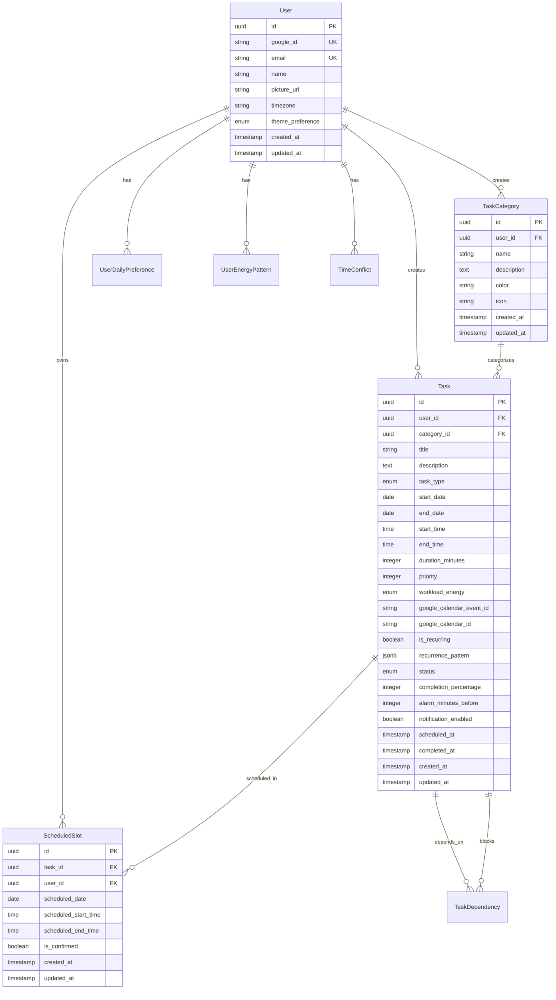
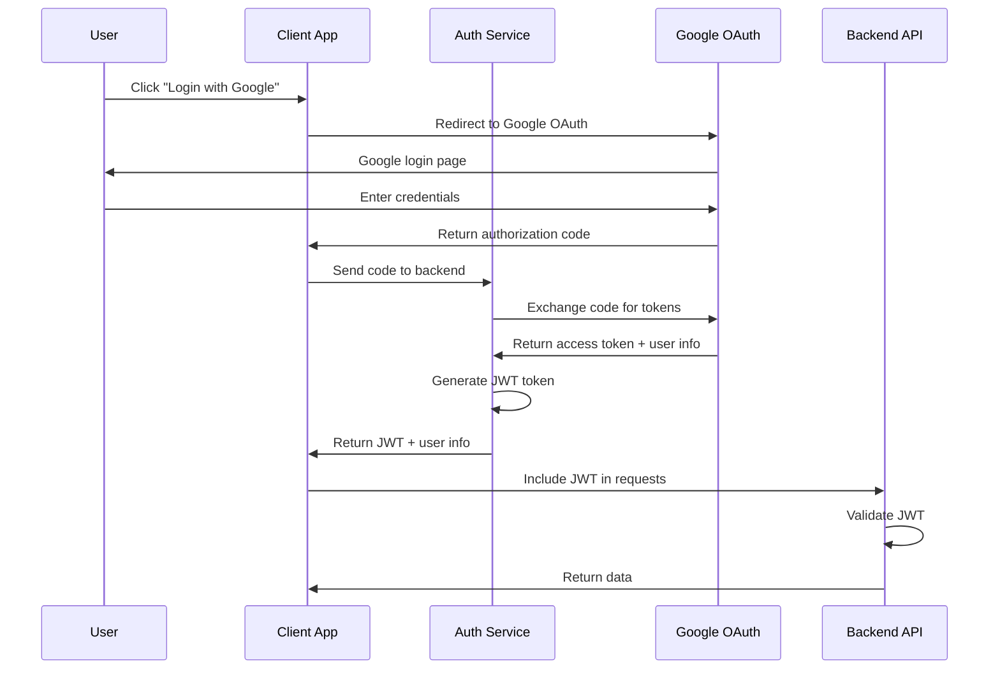

# Smart Task Manager - Architecture Overview

This document provides a comprehensive overview of the Smart Task Manager architecture, design patterns, and system components.

## Table of Contents

- [System Overview](#system-overview)
- [Architecture Patterns](#architecture-patterns)
- [Backend Architecture](#backend-architecture)
- [Desktop Application Architecture](#desktop-application-architecture)
- [Android Application Architecture](#android-application-architecture)
- [Database Design](#database-design)
- [API Design](#api-design)
- [Security Architecture](#security-architecture)
- [Deployment Architecture](#deployment-architecture)
- [Performance Considerations](#performance-considerations)
- [Scalability](#scalability)

## System Overview

The Smart Task Manager is a multi-platform application built with a microservices-inspired architecture, featuring:

- **Backend API**: Node.js/Express RESTful API with WebSocket support
- **Desktop Application**: Electron-based cross-platform desktop app
- **Android Application**: Native Android app with Jetpack Compose
- **Database**: PostgreSQL with Sequelize ORM
- **Real-time Communication**: Socket.io for live updates
- **External Integrations**: Google Calendar API

### High-Level Architecture



## Architecture Patterns

### 1. Clean Architecture

The application follows Clean Architecture principles with clear separation of concerns:

```
┌─────────────────────────────────────┐
│           Presentation Layer        │
│  (UI Components, Controllers)       │
├─────────────────────────────────────┤
│           Application Layer         │
│    (Use Cases, Services)            │
├─────────────────────────────────────┤
│            Domain Layer             │
│    (Entities, Business Logic)       │
├─────────────────────────────────────┤
│          Infrastructure Layer       │
│  (Database, External APIs)          │
└─────────────────────────────────────┘
```

### 2. Microservices Pattern

While not strictly microservices, the application is designed with service-oriented architecture:

- **Task Service**: Manages task CRUD operations
- **Scheduling Service**: Handles intelligent task scheduling
- **Calendar Service**: Manages Google Calendar integration
- **User Service**: Handles user management and preferences
- **Notification Service**: Manages real-time notifications

### 3. Event-Driven Architecture

Real-time updates are handled through event-driven patterns:



## Backend Architecture

### Core Components

#### 1. Express.js Server
```javascript
// server.js structure
const express = require('express');
const cors = require('cors');
const helmet = require('helmet');
const rateLimit = require('express-rate-limit');

const app = express();

// Middleware stack
app.use(helmet());
app.use(cors());
app.use(rateLimit({ windowMs: 15 * 60 * 1000, max: 100 }));
app.use(express.json());

// Routes
app.use('/api/auth', authRoutes);
app.use('/api/tasks', taskRoutes);
app.use('/api/preferences', preferenceRoutes);

// WebSocket
const server = require('http').createServer(app);
const io = require('socket.io')(server);
```

#### 2. Database Layer (Sequelize ORM)
```javascript
// Model definition example
const Task = sequelize.define('Task', {
  id: { type: DataTypes.UUID, defaultValue: DataTypes.UUIDV4, primaryKey: true },
  title: { type: DataTypes.STRING(255), allowNull: false },
  taskType: { type: DataTypes.ENUM('mandatory', 'desired', 'arrangable') },
  priority: { type: DataTypes.INTEGER, defaultValue: 1 },
  // ... other fields
}, {
  tableName: 'tasks',
  timestamps: true
});
```

#### 3. Service Layer
```javascript
// SchedulingService.js
class SchedulingService {
  async scheduleTasks(userId, startDate, endDate) {
    // 1. Get user preferences and energy patterns
    // 2. Fetch arrangable tasks
    // 3. Apply scheduling algorithm
    // 4. Handle conflicts
    // 5. Return results
  }
}
```

### API Design Patterns

#### 1. RESTful Design
- **GET** `/api/tasks` - List tasks
- **POST** `/api/tasks` - Create task
- **PUT** `/api/tasks/:id` - Update task
- **DELETE** `/api/tasks/:id` - Delete task

#### 2. Resource-Based URLs
- `/api/tasks` - Task collection
- `/api/tasks/:id` - Specific task
- `/api/tasks/:id/status` - Task status sub-resource

#### 3. Consistent Response Format
```json
{
  "success": true,
  "data": { ... },
  "pagination": { ... },
  "message": "Optional message"
}
```

### Authentication & Authorization

#### JWT Token Structure
```json
{
  "sub": "user_id",
  "email": "user@example.com",
  "iat": 1640995200,
  "exp": 1641600000,
  "scope": ["tasks:read", "tasks:write", "calendar:sync"]
}
```

#### Middleware Stack
```javascript
// Authentication middleware
const authenticateToken = (req, res, next) => {
  const token = req.headers['authorization']?.split(' ')[1];
  if (!token) return res.status(401).json({ error: 'Token required' });
  
  jwt.verify(token, process.env.JWT_SECRET, (err, user) => {
    if (err) return res.status(403).json({ error: 'Invalid token' });
    req.user = user;
    next();
  });
};
```

## Desktop Application Architecture

### Technology Stack
- **Framework**: Electron + React 18
- **State Management**: Zustand
- **UI Library**: Tailwind CSS + Headless UI
- **Routing**: React Router v6
- **HTTP Client**: Axios with interceptors

### Component Architecture

#### 1. Component Hierarchy
```
App
├── Navbar
├── Sidebar
└── Main Content
    ├── DashboardPage
    ├── TasksPage
    │   ├── TaskList
    │   ├── TaskForm
    │   └── TaskItem
    ├── CalendarPage
    ├── PreferencesPage
    └── SettingsPage
```

#### 2. State Management (Zustand)
```javascript
// authStore.js
export const useAuthStore = create((set, get) => ({
  user: null,
  token: null,
  isLoading: false,
  
  login: async (credentials) => {
    set({ isLoading: true });
    try {
      const response = await authService.login(credentials);
      set({ user: response.user, token: response.token });
    } catch (error) {
      throw error;
    } finally {
      set({ isLoading: false });
    }
  },
  
  logout: () => set({ user: null, token: null })
}));
```

#### 3. Service Layer
```javascript
// ApiService.js
class ApiService {
  constructor() {
    this.api = axios.create({
      baseURL: process.env.REACT_APP_API_URL,
      timeout: 10000
    });
    
    // Request interceptor for auth
    this.api.interceptors.request.use((config) => {
      const token = useAuthStore.getState().token;
      if (token) {
        config.headers.Authorization = `Bearer ${token}`;
      }
      return config;
    });
  }
}
```

### Electron Integration

#### 1. Main Process (electron.js)
```javascript
const { app, BrowserWindow, Menu } = require('electron');

function createWindow() {
  const mainWindow = new BrowserWindow({
    width: 1200,
    height: 800,
    webPreferences: {
      nodeIntegration: false,
      contextIsolation: true,
      preload: path.join(__dirname, 'preload.js')
    }
  });
  
  // Load React app
  mainWindow.loadURL('http://localhost:3000');
}

// Menu setup
const template = [
  {
    label: 'File',
    submenu: [
      { label: 'New Task', accelerator: 'CmdOrCtrl+N' },
      { label: 'Sync Calendar', accelerator: 'CmdOrCtrl+S' }
    ]
  }
];
```

#### 2. Preload Script (preload.js)
```javascript
const { contextBridge, ipcRenderer } = require('electron');

contextBridge.exposeInMainWorld('electronAPI', {
  onMenuNewTask: (callback) => ipcRenderer.on('menu-new-task', callback),
  onMenuSyncCalendar: (callback) => ipcRenderer.on('menu-sync-calendar', callback)
});
```

## Android Application Architecture

### Technology Stack
- **Language**: Kotlin
- **UI Framework**: Jetpack Compose
- **Architecture**: MVVM + Clean Architecture
- **Dependency Injection**: Hilt
- **Database**: Room
- **Networking**: Retrofit + OkHttp

### Clean Architecture Layers

#### 1. Presentation Layer
```kotlin
// ViewModel
@HiltViewModel
class TaskViewModel @Inject constructor(
    private val getTasksUseCase: GetTasksUseCase,
    private val createTaskUseCase: CreateTaskUseCase
) : ViewModel() {
    
    private val _tasks = MutableStateFlow<List<Task>>(emptyList())
    val tasks: StateFlow<List<Task>> = _tasks.asStateFlow()
    
    fun loadTasks() {
        viewModelScope.launch {
            getTasksUseCase().collect { _tasks.value = it }
        }
    }
}
```

#### 2. Domain Layer
```kotlin
// Use Case
class GetTasksUseCase @Inject constructor(
    private val taskRepository: TaskRepository
) {
    operator fun invoke(): Flow<List<Task>> {
        return taskRepository.getTasks()
    }
}

// Entity
data class Task(
    val id: String,
    val title: String,
    val description: String,
    val taskType: TaskType,
    val priority: Int,
    val status: TaskStatus
)
```

#### 3. Data Layer
```kotlin
// Repository
@Singleton
class TaskRepositoryImpl @Inject constructor(
    private val localDataSource: TaskLocalDataSource,
    private val remoteDataSource: TaskRemoteDataSource
) : TaskRepository {
    
    override fun getTasks(): Flow<List<Task>> {
        return flow {
            emit(localDataSource.getTasks())
            try {
                val remoteTasks = remoteDataSource.getTasks()
                localDataSource.saveTasks(remoteTasks)
                emit(remoteTasks)
            } catch (e: Exception) {
                // Handle offline scenario
            }
        }
    }
}
```

### Room Database
```kotlin
// Entity
@Entity(tableName = "tasks")
data class TaskEntity(
    @PrimaryKey val id: String,
    val title: String,
    val description: String,
    val taskType: String,
    val priority: Int,
    val status: String,
    val createdAt: Long,
    val updatedAt: Long
)

// DAO
@Dao
interface TaskDao {
    @Query("SELECT * FROM tasks ORDER BY priority ASC, createdAt DESC")
    fun getTasks(): Flow<List<TaskEntity>>
    
    @Insert(onConflict = OnConflictStrategy.REPLACE)
    suspend fun insertTask(task: TaskEntity)
    
    @Update
    suspend fun updateTask(task: TaskEntity)
    
    @Delete
    suspend fun deleteTask(task: TaskEntity)
}
```

## Database Design

### Entity Relationship Diagram



### Database Indexes

```sql
-- Performance indexes
CREATE INDEX idx_tasks_user_id ON tasks(user_id);
CREATE INDEX idx_tasks_status ON tasks(status);
CREATE INDEX idx_tasks_task_type ON tasks(task_type);
CREATE INDEX idx_tasks_priority ON tasks(priority);
CREATE INDEX idx_tasks_start_date ON tasks(start_date);
CREATE INDEX idx_tasks_end_date ON tasks(end_date);
CREATE INDEX idx_scheduled_slots_user_date ON scheduled_slots(user_id, scheduled_date);
CREATE INDEX idx_scheduled_slots_task_id ON scheduled_slots(task_id);
```

## API Design

### RESTful Endpoints

#### Task Management
```
GET    /api/tasks                    # List tasks
POST   /api/tasks                    # Create task
GET    /api/tasks/:id                # Get task
PUT    /api/tasks/:id                # Update task
DELETE /api/tasks/:id                # Delete task
POST   /api/tasks/schedule           # Trigger scheduling
GET    /api/tasks/scheduled/:date    # Get scheduled tasks
PUT    /api/tasks/:id/status         # Update task status
POST   /api/tasks/sync-calendar      # Sync with calendar
```

#### User Management
```
GET    /api/user/profile             # Get user profile
PUT    /api/user/profile             # Update user profile
GET    /api/preferences              # Get user preferences
PUT    /api/preferences              # Update preferences
```

### WebSocket Events

#### Client → Server
```javascript
// Join user room
socket.emit('join_user_room', { userId: 'user_id' });

// Request real-time updates
socket.emit('subscribe_tasks', { userId: 'user_id' });
```

#### Server → Client
```javascript
// Task events
socket.emit('task_created', { task: taskData });
socket.emit('task_updated', { task: taskData });
socket.emit('task_deleted', { taskId: 'task_id' });
socket.emit('task_scheduled', { taskId: 'task_id', scheduledSlot: slotData });

// Calendar events
socket.emit('calendar_synced', { syncedTasks: 15, createdEvents: 8 });
```

## Security Architecture

### Authentication Flow



### Security Measures

#### 1. JWT Token Security
- **Secret Key**: 256-bit random secret
- **Expiration**: 7 days for access token
- **Refresh Token**: 30 days for refresh token
- **Algorithm**: HS256

#### 2. API Security
- **HTTPS**: All communications encrypted
- **CORS**: Configured for specific origins
- **Rate Limiting**: 100 requests per 15 minutes
- **Input Validation**: All inputs validated and sanitized
- **SQL Injection**: Prevented by Sequelize ORM

#### 3. Data Protection
- **Encryption at Rest**: Sensitive data encrypted in database
- **Password Hashing**: bcrypt with salt rounds
- **PII Protection**: User data anonymized where possible

## Deployment Architecture

### Development Environment
```
┌─────────────────┐    ┌─────────────────┐    ┌─────────────────┐
│   Desktop App   │    │   Android App   │    │   Backend API   │
│   (Electron)    │    │   (Emulator)    │    │   (Node.js)     │
│   Port: 3001    │    │   Port: 8080    │    │   Port: 3000    │
└─────────────────┘    └─────────────────┘    └─────────────────┘
         │                       │                       │
         └───────────────────────┼───────────────────────┘
                                 │
                    ┌─────────────────┐
                    │   PostgreSQL    │
                    │   Port: 5432    │
                    └─────────────────┘
```

### Production Environment
```
┌─────────────────┐    ┌─────────────────┐
│   Load Balancer │    │   CDN           │
│   (Nginx)       │    │   (Static Files)│
└─────────────────┘    └─────────────────┘
         │
┌─────────────────┐
│   Backend API   │
│   (Docker)      │
└─────────────────┘
         │
┌─────────────────┐
│   PostgreSQL    │
│   (Managed)     │
└─────────────────┘
```

### Docker Configuration

#### Backend Dockerfile
```dockerfile
FROM node:18-alpine

WORKDIR /app

COPY package*.json ./
RUN npm ci --only=production

COPY . .

EXPOSE 3000

CMD ["npm", "start"]
```

#### Docker Compose
```yaml
version: '3.8'
services:
  backend:
    build: ./backend
    ports:
      - "3000:3000"
    environment:
      - NODE_ENV=production
      - DB_HOST=postgres
    depends_on:
      - postgres
  
  postgres:
    image: postgres:14
    environment:
      - POSTGRES_DB=smart_task_manager
      - POSTGRES_USER=smarttaskmanager
      - POSTGRES_PASSWORD=secure_password
    volumes:
      - postgres_data:/var/lib/postgresql/data

volumes:
  postgres_data:
```

## Performance Considerations

### Backend Performance

#### 1. Database Optimization
- **Indexes**: Strategic indexing on frequently queried columns
- **Connection Pooling**: pg-pool for database connections
- **Query Optimization**: Efficient Sequelize queries
- **Caching**: Redis for frequently accessed data

#### 2. API Performance
- **Compression**: gzip compression for responses
- **Pagination**: Limit response sizes
- **Rate Limiting**: Prevent abuse
- **Caching Headers**: Appropriate cache headers

### Frontend Performance

#### 1. Desktop Application
- **Code Splitting**: Lazy loading of components
- **Bundle Optimization**: Webpack optimization
- **Memory Management**: Proper cleanup of event listeners
- **Electron Optimization**: Efficient main/renderer process communication

#### 2. Android Application
- **Offline-First**: Room database for offline access
- **Background Sync**: WorkManager for background tasks
- **Image Optimization**: Glide for efficient image loading
- **Memory Management**: Proper lifecycle management

### Real-time Performance

#### WebSocket Optimization
- **Connection Pooling**: Efficient WebSocket connections
- **Event Batching**: Batch multiple events
- **Room Management**: Efficient room-based broadcasting
- **Heartbeat**: Keep-alive mechanism

## Scalability

### Horizontal Scaling

#### 1. Backend Scaling
- **Load Balancer**: Distribute requests across multiple instances
- **Stateless Design**: No server-side session storage
- **Database Scaling**: Read replicas for read-heavy operations
- **Caching Layer**: Redis cluster for distributed caching

#### 2. Database Scaling
- **Read Replicas**: Separate read and write operations
- **Sharding**: Partition data by user ID
- **Connection Pooling**: Efficient connection management

### Vertical Scaling

#### 1. Resource Optimization
- **Memory Usage**: Efficient memory management
- **CPU Usage**: Optimized algorithms
- **I/O Operations**: Async/await patterns
- **Garbage Collection**: Proper cleanup

#### 2. Monitoring
- **Application Metrics**: Performance monitoring
- **Database Metrics**: Query performance tracking
- **Error Tracking**: Comprehensive error logging
- **Health Checks**: Service health monitoring

## Future Architecture Considerations

### Microservices Migration
- **Service Decomposition**: Split monolith into microservices
- **API Gateway**: Centralized API management
- **Service Discovery**: Dynamic service registration
- **Event Sourcing**: Event-driven architecture

### Cloud-Native Features
- **Container Orchestration**: Kubernetes deployment
- **Service Mesh**: Istio for service communication
- **Observability**: Distributed tracing and monitoring
- **Auto-scaling**: Dynamic resource allocation

### Advanced Features
- **Machine Learning**: AI-powered scheduling
- **Real-time Analytics**: Live performance metrics
- **Multi-tenancy**: Support for multiple organizations
- **Federation**: Cross-platform data synchronization

---

This architecture provides a solid foundation for the Smart Task Manager while maintaining flexibility for future enhancements and scaling requirements.
